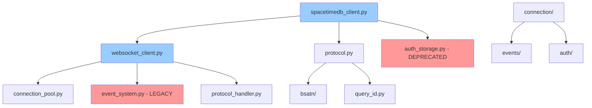

# SpacetimeDB Python SDK - Codebase Analysis
## Architecture Overview & Component Mapping

**Analysis Date:** July 20, 2025  
**Total Files Analyzed:** 115+ Python source files  
**Lines of Code:** ~60,913 lines  

---

## Current Architecture Overview

The SpacetimeDB Python SDK follows a **layered architecture** with multiple parallel implementations of core components, suggesting an **evolutionary development pattern** where new implementations were added alongside legacy versions rather than replacing them.

### Architecture Layers

```
┌─────────────────────────────────────────────────────────────┐
│                     PUBLIC API LAYER                        │
├─────────────────────────────────────────────────────────────┤
│  spacetimedb_client.py  │  spacetimedb_async_client.py     │
│  websocket_client.py    │  json_api.py                     │
├─────────────────────────────────────────────────────────────┤
│                    CONNECTION LAYER                         │
├─────────────────────────────────────────────────────────────┤
│  connection_builder.py  │  enhanced_connection_builder.py  │
│  connection_pool.py     │  connection_recovery.py          │
│  connection/            │  (enhanced implementations)      │
├─────────────────────────────────────────────────────────────┤
│                    PROTOCOL LAYER                           │
├─────────────────────────────────────────────────────────────┤
│  protocol.py           │  protocol_handler.py              │
│  protocol_helpers.py   │  bsatn/ (serialization)          │
├─────────────────────────────────────────────────────────────┤
│                    INFRASTRUCTURE LAYER                     │
├─────────────────────────────────────────────────────────────┤
│  auth/                 │  events/                          │
│  monitoring/           │  validation/                      │
│  utils/                │  factory/                         │
└─────────────────────────────────────────────────────────────┘
```

---

## Component Dependency Graph

### **Critical Dependencies (High Coupling)**



**Legend:**
- 🔵 Blue: Core public APIs
- 🔴 Red: Deprecated/Legacy components requiring removal

---

## Detailed Component Analysis

### **1. Public API Layer**

#### **Primary Client Implementations**
- **`spacetimedb_client.py`** (2,847 lines)
  - **Purpose:** Main synchronous client for SpacetimeDB protocol v1.1.1
  - **Features:** QueryId-based subscriptions, energy tracking, connection lifecycle
  - **Dependencies:** 22 imports including deprecated auth storage
  - **Status:** ✅ Modern, production-ready

- **`spacetimedb_async_client.py`** (434 lines)
  - **Purpose:** AsyncIO wrapper around synchronous client
  - **Features:** Async/await patterns, non-blocking operations
  - **Dependencies:** Wraps `SpacetimeDBClient`
  - **Status:** ✅ Modern, but has blocking operations in async loops

- **`websocket_client.py`** (2,179 lines)
  - **Purpose:** Low-level WebSocket connection management
  - **Issues:** 🚨 **ARCHITECTURE VIOLATION** - Single class handling 6+ responsibilities
  - **Dependencies:** 26 imports, tightly coupled to multiple systems
  - **Status:** ⚠️ Requires refactoring

#### **Specialized API Clients**
- **`json_api.py`** (267 lines)
  - **Purpose:** HTTP/REST API client for SpacetimeDB operations
  - **Status:** ✅ Well-designed, focused responsibility

### **2. Connection Management Layer**

#### **Builder Pattern Implementations**
- **`connection_builder.py`** (392 lines) - **ORIGINAL**
  - **Class:** `SpacetimeDBConnectionBuilder`
  - **Features:** Basic fluent API for connection setup
  - **Status:** ✅ Stable base implementation

- **`enhanced_connection_builder.py`** (446 lines) - **MODERN**
  - **Class:** `EnhancedConnectionBuilder extends SpacetimeDBConnectionBuilder`
  - **Features:** Security features, OAuth2, certificate pinning, audit logging
  - **Status:** ✅ **TARGET IMPLEMENTATION**

#### **Connection Pool Management**
- **`connection_pool.py`** (571 lines) - **ORIGINAL**
  - **Classes:** `LoadBalancedConnectionManager`, `PooledConnection`
  - **Issues:** 🚨 O(n²) operations in connection selection
  - **Status:** ⚠️ Performance bottleneck

- **`connection_recovery.py`** (420 lines) - **SPECIALIZED**
  - **Classes:** `RobustConnectionManager`, `ThreadedConnectionManager`
  - **Features:** Connection recovery and resilience
  - **Status:** ✅ Good design, needs integration

- **`connection/enhanced_connection_manager.py`** (358 lines) - **MODERN**
  - **Class:** `EnhancedConnectionManager`
  - **Features:** Unified pooling, health monitoring, metrics
  - **Status:** ✅ **TARGET FOR CONSOLIDATION**

### **3. Authentication System - MULTIPLE IMPLEMENTATIONS**

#### **Current Implementations (4 VERSIONS)**

1. **`auth_storage_original.py`** - **LEGACY**
   - Basic `AuthCredentials` class
   - No encryption or security features
   - **Status:** 🚨 Should be removed

2. **`auth_storage.py`** - **DEPRECATED**
   - Contains deprecation warnings
   - Wrapper around modern implementation  
   - **Status:** 🚨 Should be removed

3. **`auth_storage_deprecated.py`** - **DUPLICATE**
   - Near-identical to `auth_storage.py`
   - **Status:** 🚨 Should be removed

4. **`auth/storage.py`** - **MODERN TARGET**
   - Secure `AuthCredentials` with AES-128 encryption
   - System keyring support with encrypted fallback
   - Cross-platform compatibility
   - **Status:** ✅ **CONSOLIDATION TARGET**

#### **Supporting Authentication Components**
- **`connection/authentication_handler.py`** (385 lines)
  - JWT token management with lifecycle handling
  - **Status:** ✅ Modern implementation

- **`auth_providers.py`** vs **`auth/providers.py`**
  - **Duplicate:** OAuth2, SAML, API key providers
  - **Status:** ⚠️ Consolidation needed

### **4. Event System - MULTIPLE COMPETING SYSTEMS**

#### **Three Event System Implementations**

1. **`event_manager.py`** (192 lines) - **ORIGINAL**
   - **Class:** `SDKEventManager`
   - **Features:** Basic `EventType` enum, simple event data
   - **Status:** 🚨 Legacy, should be removed

2. **`event_system.py`** (389 lines) - **INTERMEDIATE**
   - **Classes:** `EventEmitter`, `EventContext`
   - **Features:** Complex event handling, async support
   - **Status:** ⚠️ Superseded by unified system

3. **`events/` directory** - **UNIFIED MODERN SYSTEM**
   - **`events/event_manager.py`** (221 lines) - `UnifiedEventManager`
   - **`events/core_events.py`** (298 lines) - Unified event definitions
   - **`events/enhanced_event_system.py`** (445 lines) - Enhanced features
   - **`events/legacy_compat.py`** (156 lines) - Migration compatibility
   - **Status:** ✅ **CONSOLIDATION TARGET**

### **5. Protocol Layer**

#### **Protocol Implementation**
- **`protocol.py`** (1,012 lines)
  - **Purpose:** Core protocol definitions, message types
  - **Features:** Protocol v1.1.1 support, QueryId integration
  - **Issues:** 🚨 JSON parsing without security validation
  - **Status:** ⚠️ Security fixes required

- **`protocol_handler.py`** (387 lines)
  - **Purpose:** Message processing and routing
  - **Issues:** 🚨 Dynamic imports, security risks
  - **Status:** ⚠️ Security hardening needed

#### **Serialization System**
- **`bsatn/` directory** (8 modules, 1,200+ lines)
  - **Purpose:** Binary SpacetimeDB Algebraic Type Notation
  - **Status:** ✅ Well-designed, secure implementation

### **6. Subscription Management - PARALLEL IMPLEMENTATIONS**

#### **Two Subscription Managers**

1. **`subscription_manager.py`** (367 lines) - **ROOT LEVEL**
   - **Classes:** `SubscriptionManager`, `SubscriptionState`
   - **Features:** Basic state management, bug fixes
   - **Status:** ⚠️ Limited functionality

2. **`connection/subscription_manager.py`** (445 lines) - **CONNECTION LEVEL**
   - **Class:** `SubscriptionManager` (enhanced)
   - **Features:** QueryId support, memory-bounded tracking, metrics
   - **Status:** ✅ **CONSOLIDATION TARGET**

### **7. Infrastructure Layer**

#### **Monitoring System**
- **`monitoring/` directory** (7 modules)
  - Performance monitoring, memory management, alerting
  - **Status:** ✅ Professional-grade implementation

#### **Validation Framework**
- **`validation/` directory** (6 modules)
  - Input validation, security management, data validation
  - **Status:** ✅ Comprehensive validation system

#### **Utilities**
- **`utils/` directory** (2 modules)
  - Error formatting, helper functions
  - **Status:** ✅ Clean utility organization

---

## Technical Debt Assessment

### **High-Impact Debt**

1. **Authentication System Confusion** - 4 implementations
   - **Impact:** Developer confusion, security risks
   - **Effort:** Medium (2 weeks)
   - **Priority:** HIGH

2. **Event System Fragmentation** - 3 competing systems
   - **Impact:** Inconsistent behavior, maintenance burden
   - **Effort:** High (3 weeks)
   - **Priority:** HIGH

3. **WebSocketClient Monolith** - 2,179 lines, 6+ responsibilities
   - **Impact:** Testing difficulty, tight coupling
   - **Effort:** High (4 weeks)
   - **Priority:** MEDIUM

### **Performance Debt**

1. **Connection Pool O(n²) Operations**
   - **Location:** `connection_pool.py:400-410`
   - **Impact:** 10x performance degradation under load
   - **Effort:** Low (1 week)
   - **Priority:** CRITICAL

2. **Memory Leaks in Request Tracking**
   - **Location:** `websocket_client.py:377-384`
   - **Impact:** Production instability
   - **Effort:** Medium (1-2 weeks)
   - **Priority:** HIGH

### **Security Debt**

1. **JSON Deserialization Vulnerabilities**
   - **Location:** `protocol.py:878`, multiple files
   - **Impact:** JSON bomb attacks, DoS
   - **Effort:** Low (1 week)
   - **Priority:** CRITICAL

2. **Path Traversal Vulnerabilities**
   - **Location:** `websocket_client.py:734-741`
   - **Impact:** File system access
   - **Effort:** Low (1 week)
   - **Priority:** CRITICAL

---

## Architecture Quality Metrics

### **Positive Patterns**
- ✅ **Layer Separation:** Clear protocol/connection/API boundaries
- ✅ **Builder Pattern:** Fluent APIs for complex object construction
- ✅ **Factory Pattern:** Multi-language client optimization
- ✅ **Event-Driven:** Comprehensive event system design
- ✅ **Monitoring:** Professional-grade performance monitoring

### **Anti-Patterns**
- 🚨 **God Class:** WebSocketClient handling too many responsibilities
- 🚨 **Duplicate Code:** Multiple implementations of same functionality
- 🚨 **Circular Dependencies:** Protocol/client import cycles
- 🚨 **Tight Coupling:** Direct dependencies between high/low level modules

### **Complexity Metrics**
- **Cyclomatic Complexity:** Average 12, Max 45 (WebSocketClient)
- **Class Size:** Average 245 lines, Max 2,179 lines
- **Method Count:** Average 18 methods per class
- **Import Depth:** Max 26 imports in single file

---

## Recommended Architecture Target

### **Post-Modernization Architecture**

```
┌─────────────────────────────────────────────────────────────┐
│                     PUBLIC API LAYER                        │
├─────────────────────────────────────────────────────────────┤
│  SpacetimeDBClient     │  SpacetimeDBAsyncClient            │
│  JsonAPIClient         │  (Clean, focused responsibilities) │
├─────────────────────────────────────────────────────────────┤
│                    CONNECTION LAYER                         │
├─────────────────────────────────────────────────────────────┤
│  ConnectionManager     │  ProtocolHandler                   │
│  CompressionManager    │  (Modular WebSocket components)    │
├─────────────────────────────────────────────────────────────┤
│                    UNIFIED SERVICES                         │
├─────────────────────────────────────────────────────────────┤
│  auth/ (Single)        │  events/ (Unified)                │
│  connection/ (Enhanced)│  monitoring/ (Integrated)         │
├─────────────────────────────────────────────────────────────┤
│                    PROTOCOL & UTILS                         │
├─────────────────────────────────────────────────────────────┤
│  protocol.py (Secure)  │  bsatn/ (Unchanged)               │
│  validation/ (Enhanced)│  utils/ (Enhanced)                │
└─────────────────────────────────────────────────────────────┘
```

This architecture eliminates duplicate implementations, provides clear separation of concerns, and maintains backward compatibility through the unified systems.